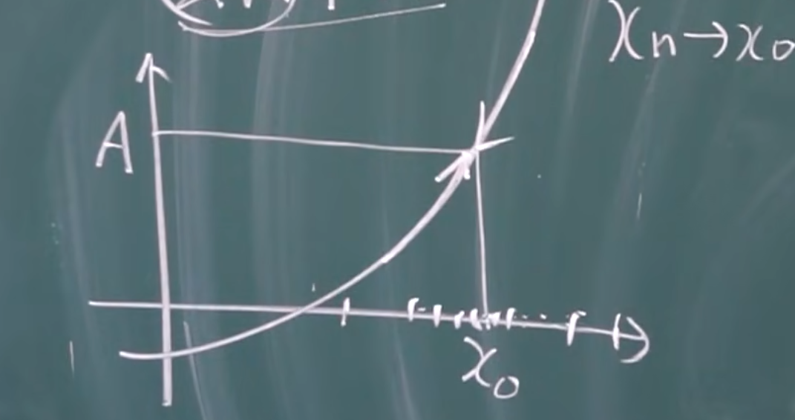

## 函数极限

这节用的是原始定义 $\epsilon$ 定义，真实做题的时候用的比较少

### 定义

人话: 当 $x→a$ 时，$f(x)→b$

$f(x)$ 在 $x_0$ 的一个**去心邻域**内有定义，$\exist A, \forall \epsilon>0, \exist \delta>0$，使得当 $0<|x-x_0|<\delta$ 时 $|f(x)-A|<\epsilon$

则称

$lim_{x→x_0}f(x)=A$

或

$f(x)→A, (x→x_0)$

* 这里的 $\epsilon$ 表示函数值和函数极限之间的距离

* 直观理解: 不论从哪个方向（左边还是右边）逼近，函数值都会趋近于一个特定值
    

* $\delta$ 表示充分接近
    

#### 注意点

* 函数在 $x=x_0$ 时可以无意义 （相对于连续，在 $x_0$ 处需要有定义）

#### 例: 常函数的极限是自身

证明 $lim_{x→x_0}C=C$

整体思路，寻找 $\delta$

$\forall \epsilon>0, \exist \delta=......$ 使得当 $0<|x-x_0|<\delta$ 时 $|f(x)-A|<\epsilon$

而 $|f(x)-A|=|C-C|=0<\epsilon$

所以 $\delta$ 任取一个正数就行

证明反着写

#### 例

证明 $lim_{x→x_0}x=x_0$

整体思路，寻找 $\delta$

$\forall \epsilon>0, \exist \delta=......$ 使得当 $0<|x-x_0|<\delta$ 时 $|f(x)-A|<\epsilon$

观察得 $|f(x)-A|=|x-x_0|<\epsilon$

取 $\delta=\epsilon$ 即可

其实 $\delta$ 取 $\frac \epsilon 2$，$\frac \epsilon 3$ .. 都行

$|f(x)-A|=|x-x_0|<\frac \epsilon 2<\epsilon$

#### 例

证明 $lim_{x→1}(2x-1)=1$

$\forall \epsilon>0, \exist \delta=......$ 使得当 $0<|x-x_0|<\delta$ 时 $|f(x)-A|<\epsilon$

$|f(x)-A|=|2x-1-1|=2|x-1|<\epsilon$

$\therefore |x-1|<\frac \epsilon 2$

$|x-x_0|=|x-1|<\frac \epsilon 2$

取 $\delta=\frac \epsilon 2$ 即可

#### 例

证明 $lim_{x→1}\frac {x^2-1} {x-1}=2$

注意函数在 $x=1$ 处是没有定义的

$\forall \epsilon>0, \exist \delta=......$ 使得当 $0<|x-x_0|<\delta$ 时 $|f(x)-2|<\epsilon$

$|f(x)-2|=|\frac {x^2-1-2(x-1)} {x-1}|=|\frac {(x-1)(x+1)-2(x-1)} {x-1}|$

$=x-1$

$|x-x_0|=|x-1|$

取 $\delta=\epsilon$

### 左极限和右极限

左极限: $lim_{x→x_0^-}$=A

从左边逼近极限

此时: $0<x_0-x<\delta$

右极限: $lim_{x→x_0^+}$=A

此时: $0<x-x_0<\delta$

从右边逼近极限

上述称单侧极限

#### 推论

* $x→x_0, f(x)$ 极限存在 $\Leftrightarrow$ 左右极限存在且相等
    $f(x_0^-)=f(x_0^+)$

#### 例

$f(x)=\left\{
    \begin{aligned}
    x-1 &,x < 0\\
    0 &,x=0\\
    x+1 &,x>0
    \end{aligned}
\right.$，证明当 $x→0$ 时，极限不存在

证:

$lim_{x→0^-}=-1$

$lim_{x→0^+}=1$

左右极限不相等，所以极限不存在

### 无穷大时的函数极限

$x→\infty$，对于 $\forall \epsilon>0$，$\exist$ 正数 $X$，使得当 $|x|>X$ 时，$|f(x)-A|<\epsilon$

则 $lim_{x→\infty}f(x)=A$

人话：趋于无穷时，函数和A充分接近

#### 例

证明 $lim_{x→\infty}\frac 1 x=0$

证: 

$\forall \epsilon>0, \exist X=......$，使得当 $|x|>X$ 时，$|\frac 1 x|<\epsilon$

分析: $|\frac 1 x|<\epsilon$

即: $|x|>\frac 1 \epsilon$

取 $x=\frac 1 \epsilon$ 即可

### 函数极限的性质

#### 唯一性

如果函数的极限存在，则这个极限唯一

#### 局部有界性

若 $lim_{x→x_0}f(x)=A, \exist M>0, \exist \delta>0$，使得当 $0<|x-x_0|<\delta$ 时，$|f(x)|\leq M$

人话：当x从极值点两边逼近时，函数的y值也会收缩到一个接近极限的范围内

#### 局部保号性

若  $lim_{x→x_0}f(x)=A$，并且 $A>0(<0)$，则 $\exist\delta>0$，使得当 $0<|x-x_0|<\delta$ 时 $f(x)>0(<0)$

局部表示范围限定在 $0<|x-x_0|<\delta$

#### 函数极限和数列极限的关系

若存在 $lim_{x→x_0}f(x)=A$，$\{x_n\}→x_0$，则 $lim_{n→\infty}f(x_n)=lim_{x→x_0}f(x)$

2024.2.28
2024.2.29
2024.3.1
