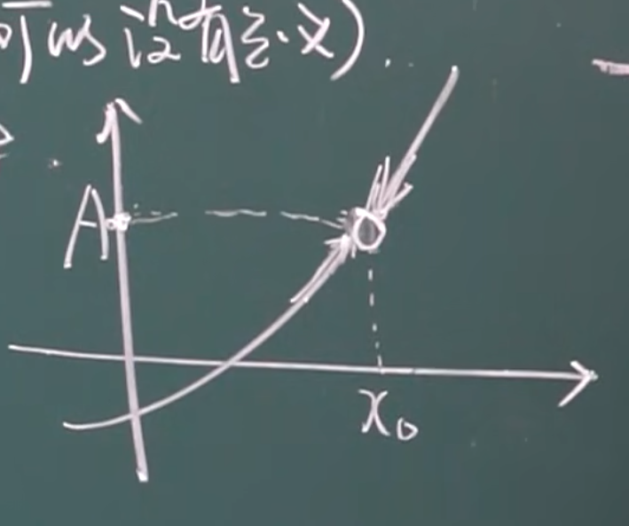
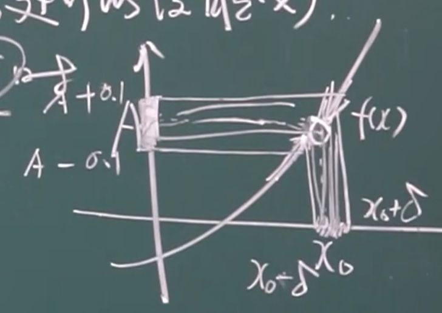

## 函数极限

这节用的是原始定义 $\epsilon$ 定义，真实做题的时候用的比较少

### 定义

人话: 当 $x→a$ 时，$f(x)→b$

$f(x)$ 在 $x_0$ 的一个**去心邻域**内有定义，$\exist A, \forall \epsilon>0, \exist \delta>0$，使得当 $0<|x-x_0|<\delta$ 时 $|f(x)-A|<\epsilon$

则称

$lim_{x→x_0}f(x)=A$

或

$f(x)→A, (x→x_0)$

* 这里的 $\epsilon$ 表示函数值和函数极限之间的距离

* 直观理解: 不论从哪个方向（左边还是右边）逼近，函数值都会趋近于一个特定值
    

* $\delta$ 表示充分接近
    

#### 注意点

* 函数在 $x=x_0$ 时可以无意义 （相对于连续，在 $x_0$ 处需要有定义）

#### 例: 常函数的极限是自身

证明 $lim_{x→x_0}C=C$

整体思路，寻找 $\delta$

$\forall \epsilon>0, \exist \delta=......$ 使得当 $0<|x-x_0|<\delta$ 时 $|f(x)-A|<\epsilon$

而 $|f(x)-A|=|C-C|=0<\epsilon$

所以 $\delta$ 任取一个正数就行

证明反着写

#### 例

证明 $lim_{x→x_0}x=x_0$

整体思路，寻找 $\delta$

$\forall \epsilon>0, \exist \delta=......$ 使得当 $0<|x-x_0|<\delta$ 时 $|f(x)-A|<\epsilon$

观察得 $|f(x)-A|=|x-x_0|<\epsilon$

取 $\delta=\epsilon$ 即可

其实 $\delta$ 取 $\frac \epsilon 2$，$\frac \epsilon 3$ ..都行

$|f(x)-A|=|x-x_0|<\frac \epsilon 2<\epsilon$

#### 例

证明 $lim_{x→1}(2x-1)=1$

$\forall \epsilon>0, \exist \delta=......$ 使得当 $0<|x-x_0|<\delta$ 时 $|f(x)-A|<\epsilon$

$|f(x)-A|=|2x-1-1|=2|x-1|<\epsilon$

$\therefore |x-1|<\frac \epsilon 2$

$|x-x_0|=|x-1|<\frac \epsilon 2$

取 $\delta=\frac \epsilon 2$ 即可

#### 例

证明 $lim_{x→1}\frac {x^2-1} {x-1}=2$

注意函数在 $x=1$ 处是没有定义的

$\forall \epsilon>0, \exist \delta=......$ 使得当 $0<|x-x_0|<\delta$ 时 $|f(x)-2|<\epsilon$

$|f(x)-2|=|\frac {x^2-1-2(x-1)} {x-1}|=|\frac {(x-1)(x+1)-2(x-1)} {x-1}|$

$=x-1$

$|x-x_0|=|x-1|$

取 $\delta=\epsilon$

2024.2.28
