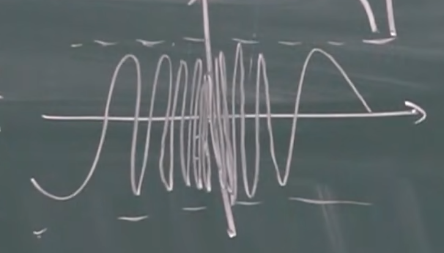
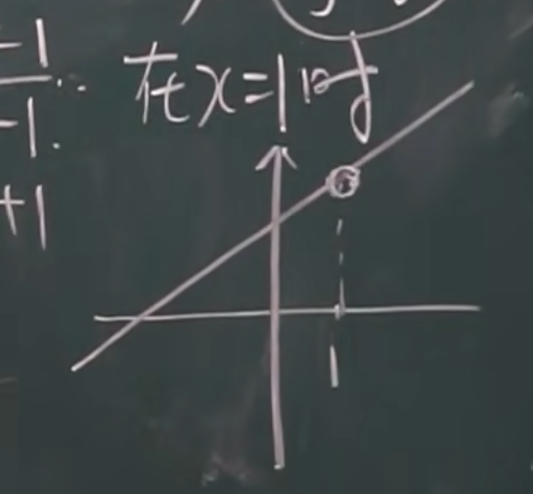
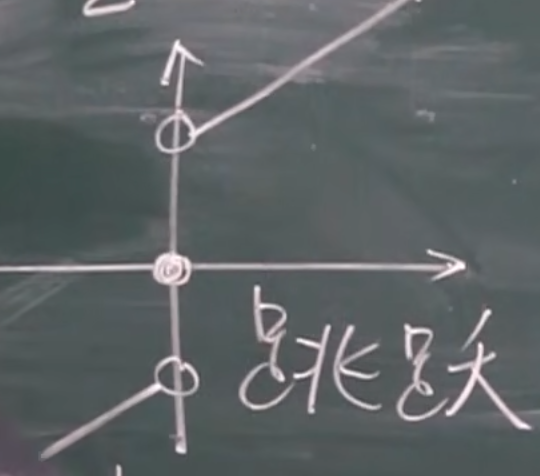

## 函数的连续性和断点

### 增量

改变一点点 $x_0→x_0+\Delta x$

* 增量不一定是增加，也可以是减少，准确地说叫改变量

当 $x$ 改变后，也可以求出 $y$ 的增量：

$\Delta y=f(x_0+\Delta x)-f(x_0)$

### 连续

#### 定义1

当 $x$ 改变一点点的时候，$y$ 值的改变也很小，即：

$lim_{\Delta x→0}\Delta y=lim_{\Delta x→0}[f(x_0+\Delta x)-f(x_0)]=0$

#### 定义2

当增量很小时，$x_0+\Delta x$ 的函数值趋近于 $f(x_0)$，即：

$lim_{\Delta x→0}f(x_0+\Delta x)=f(x_0)$

$\Rightarrow lim_{x→x_0}f(x)=f(x_0)$

这种定义用到的几率更大一点

##### 三个条件

函数在 $x_0$ 处连续的三个条件

* 函数在 $x_0$ 处，有极限

* 函数在 $x_0$ 处，有定义

* 函数在 $x_0$ 处，极限值等于函数值

#### 左连续和右连续

左连续，定义：

$lim_{x→x_0^-}f(x)=f(x_0)$

右连续，定义：

$lim_{x→x_0^+}f(x)=f(x_0)$

#### 连续和左右连续的关系

函数在某个点连续 $\Leftrightarrow$ 函数在这个点左连续 && 函数在这个点右连续

#### 连续的几何含义

连续函数（在每个点上都连续）的图形是一条连续而不间断的曲线

#### 函数连续的证明

补充：三角函数运算定律

* $cos(\alpha \pm \beta)=cos\alpha cos\beta\mp sin\alpha sin\beta$

* $sin(\alpha \pm \beta)=sin\alpha cos\beta\pm cos\alpha sin\beta$

↓ 积化和差

* $sin\alpha cos\beta=\frac 1 2[sin(\alpha + \beta)+sin(\alpha - \beta)]$

* $cos\alpha cos\beta=\frac 1 2[cos(\alpha + \beta)+cos(\alpha - \beta)]$

* $sin\alpha sin\beta=-\frac 1 2[cos(\alpha + \beta)-cos(\alpha - \beta)]$

↓ 和差化积(积化和差直接推就行)

* $sin\alpha+sin\beta=2sin\frac{\alpha+\beta} 2 cos\frac{\alpha-\beta} 2$

* $sin\alpha-sin\beta=2cos\frac{\alpha+\beta} 2 sin\frac{\alpha - \beta} 2$

* $cos\alpha+cos\beta=2cos\frac{\alpha+\beta} 2 cos\frac{\alpha-\beta} 2$

* $cos\alpha-cos\beta=-2sin\frac{\alpha+\beta} 2 sin\frac{\alpha-\beta} 2$

在求三角函数极限的过程中，常用和差化积，方便进行等价无穷小替换以求极限

### 间断

#### 定义

* 函数在 $x_0$ 处，没有定义

* 函数在 $x_0$ 处，极限不存在

* 函数在 $x_0$ 处，极限值不等于函数值

#### 无穷间断点

例如 $y=tan(x)$ 在 $x=\frac \pi 2$ 处

#### 振荡间断点

例如 $y=sin\frac 1 x$ 在 $x=0$ 时

#### 可去间断点

例如 $y=\frac {x^2-1} {x-1}=x+1$

在 $x=1$ 时没有定义

#### 跳跃间断点

举个例子

$f(x)=\left\{
    \begin{aligned}
    x-1 &, x<0\\
    0 &,x=0\\
    x+1 &,x>0
    \end{aligned}
\right.$

#### 第一类和第二类间断点

* 第一类间断点：左右极限都存在

    * 可去、跳跃间断点属于第一类间断点

    * 注意左右极限都存在即可，不需要相同

* 第二类间断点：不是第一类间断点的间断点就是第二类间断点
    
    * 振荡、无穷间断点属于第二类间断点

    * 左右极限至少有一个不存在

2024.3.3
2024.3.4