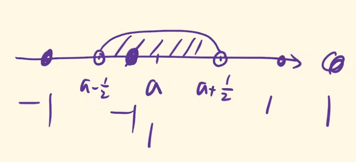

## 收敛数列性质

### 收敛数列极限唯一

#### 证明

可以用反证法证明

反证:

假设数列 $\{x_n\}$ 有两个极限 $a, b$，且 $a<b$

取 $\epsilon=\frac {b-a} 2$

$\because lim_{n→+\infty}x_n=a, \exist N_1, n>N_1$ 时  $|x_n-a|<\frac {b-a} 2$

$\therefore -\frac {b-a} 2<x_n-a<\frac {b-a} 2$

① $\therefore \frac {-b+3a} 2<x_n<\frac {b+a} 2$

$\because lim_{n→+\infty}x_n=b, \exist N_2, n>N_2$ 时  $|x_n-b|<\frac {b-a} 2$

$\therefore -\frac {b-a} 2<x_n-b<\frac {b-a} 2$

② $\therefore \frac {b+a} 2<x_n<\frac {3b-a} 2$

① ② 互相矛盾

#### 例

证明数列 $x_n=(-1)^{n+1}$ 是发散的

证:

反证: 假设收敛，且极限为 $a$

令 $\epsilon=\frac 1 2$

则 $\exist N$ 当 $n>N$ 时， $|x_n-a|<\frac 1 2$

$\therefore -\frac 1 2<x_n-a<\frac 1 2$

$\therefore a-\frac 1 2<x_n<a+\frac 1 2$

这个范围的跨度不到 1

但是这个数列两项之间的跨度为 2

#### 推论

* 若数列有两个子数列收敛于不同的极限，则原数列一定发散

    ex: $x_n=(-1)^{n+1}$ 发散

    $\because lim_{k→+\infty}x_{2k-1}=1$，且 $lim_{k→+\infty}x_{2k}=-1$

    $\therefore$ 数列发散

### 收敛数列一定是有界的

#### 证明

设 $lim_{n→+\infty}x_n=a$，则对于 $\epsilon=1$，$\exist N$，使得当 $n>N$ 时，$|x_n-a|<1$

则 $|x_n|=|x_n-a+a|\leq|x_n-a|+|a|$

$\because |x_n-a|<1$

$\therefore |x_n|<|a|+1$

① 当 $n>N$ 时，$|x_n|<|a|+1$，所以，对于 $N$ "后头"的那些项，数列是有界的

对于 $N$ "前面"的项，令 $M=max\{|x_1|,|x_2|,|x_3|,...,|a|+1\}$

② 则当 $0<n<N$ 时 $|x_n|\leq M$

综合 ① ② ，数列有界

#### 注意点

* 有界数列不一定收敛 ex:1,-1,1,-1...

### 收敛数列具有保号性

若 $lim_{n→+\infty}x_n=a$，且 $a>0(<0)$ 

则 $\exist N>0$，使得当 $n>N$ 时，$x_n>0(<0)$

#### 证明

当 $a>0$ 时，取 $\epsilon=\frac a 2>0$

则 $\exist N>0$，使得当 $n>N$ 时 $|x_n-a|<\frac a 2$

$\therefore -\frac a 2<x_n-a<\frac a 2$

$\therefore \frac a 2<x_n<\frac {3a} 2$

又 $\because a>0$

$\therefore x_n>0$

#### 推论

* 若从数列的某项起，$x_n\geq0$，且 $lim_{n→+\infty}x_n=a$，则 $a>0$

### 收敛数列的任一子数列收敛于同一极限

#### 证明

假设数列 $\{x_n\}=x_1,x_2,x_3,...,x_n$

其任一子数列 $\{x_{n_k}\}=x_{n_1},x_{n_2},x_{n_3},...,x_{n_k}$

$\because lim_{n→+\infty}x_n$

$\therefore \forall \epsilon>0 ,\exists N>0$，使得当 $n>N$ 时 $|x_n-a|<\epsilon$

取 $K=N$，当 $k>K$ 时，$n_k>n_K=n_N\geq N$

$\therefore |x_{n_k}-a|<\epsilon$

所以子数列也收敛于 $a$

2024.2.28
