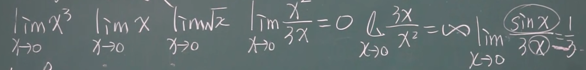

## 无穷小的比较

不同函数趋于同一极限的“速度”有可能是不同的

### 定义

两个函数 $\alpha,\beta$

* 若 $lim\frac {\beta} {\alpha}=0$，则 $\beta$ 是 $\alpha$ 的高阶无穷小，记作 $\beta = o(\alpha)$

* 若 $lim\frac {\beta} {\alpha}=\infty$，则 $\beta$ 是 $\alpha$ 的低阶无穷小

* 若 $lim\frac {\beta} {\alpha}=c\ne 0$，则 $\beta$ 是 $\alpha$ 的同阶无穷小

* 若 $lim\frac {\beta} {\alpha^k}=c\ne 0,k>0$，则 $\beta$ 是 $\alpha$ 的k阶无穷小

* 若 $lim\frac {\beta} {\alpha}=1$，则 $\beta$ 是 $\alpha$ 的等价无穷小，记作 $\alpha \sim \beta$

### 一些例子

* $lim_{x→0}\frac {sinx} x=1$ → $sinx \sim x(x→0)$

* 当 $x→0$ 时，$sinx \sim x$，$arcsinx \sim x$，$tanx \sim x$

* $x→0$ 时，$^n\sqrt {1+x} \sim \frac 1 n x$

### 定理1

$\beta$ 和 $\alpha$ 是等价无穷小 $\Leftrightarrow$ $\beta=\alpha+o(\alpha)$

### 定理2

$\alpha \sim \widetilde{\alpha}$，$\beta \sim \widetilde{\beta}$，且 $lim\frac {\widetilde{\beta}}{\widetilde{\alpha}}$ 存在 $\Rightarrow$ $lim\frac \beta \alpha=lim\frac {\widetilde{\beta}}{\widetilde{\alpha}}$

等价无穷小极限互相替换

* 必须明确知道替换完成后极限存在，才能进行替换

* 应用中常常用于将复杂的形式替换为简单形式

    * $tan\square \sim \square$

    * $sin\square \sim \square$

* 记住 $\alpha$ 和 $\alpha$ 本身也是等价无穷小，可以只替换分子或分母   
    $\Rightarrow$ 分子或分母是若干因子的**乘积**，我们可以对其中一个或者几个因子做等价无穷小替换

* 只能两个函数相除时才能用

#### 例1

求 $lim_{x→0}\frac {tan2x}{sin5x}$

解:

$tanx \sim x \Rightarrow tan\square \sim \square$

$sinx  \sim x \Rightarrow sin\square \sim \square$

原式 $=lim_{x→0}\frac {2x}{5x}=\frac 2 5$

#### 例2

求 $lim_{x→0}\frac {sinx}{x^3+3x}$

$=lim_{x→0}\frac x {x^3+3x}$

$=lim_{x→0}\frac 1 {x^2+3}=\frac 1 3$

#### 例3

求 $lim_{x→0}\frac {(1+x^2)^{\frac 1 3}-1}{cosx - 1}$

$\because$ $x→0$ 时，$^n\sqrt {1+x} \sim \frac 1 n x$

$\therefore (1+x^2)^{\frac 1 3}-1=^3\sqrt{1+x^2}-1=\frac 1 3 x^2$

原式 $=lim_{x→0}\frac {\frac 1 3 x^2}{- \frac 1 2 x^2}=-\frac 2 3$

2024.3.2
2024.3.3