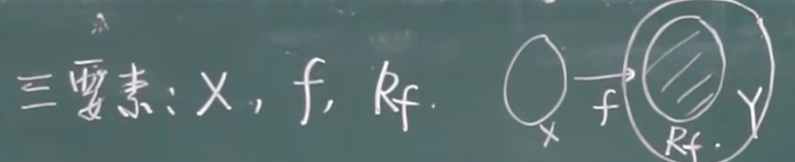

## 映射

### 映射的概念

$X、Y$是两个**非空集合**，如果存在一个法则$f$，使得对$X$中的每个元素$x$，按照法则$f$，在$Y$中有**唯一确定的**元素$y$与之对应，那么称$f$为从$X$到$Y$的映射

$f: X→Y$

$y$: 元素$x$(在映射$f$)下的**像**

$x$: 元素$y$的一个**原像**

$X$: 定义域(domain)，记作$D_f$

$X中所有元素的像组成的集合$: 值域(range)，记作$R_f$或者$f(x)$

### 注意点

* 组成映射的三个要素：定义域 对应法则 对应的值域

    * $D_f$

    * $f$

    * $R_f$

* 集合包含关系
    
    $X$里头的都得用上，$Y$里头不一定

    $R_f \subset Y$，$R_f \ne Y$

* $x→y$唯一，$y→x$不一定唯一

### 满射

$R_f=Y$

$Y$里面所有的元素都用上了

### 单射

不允许两个$x$对应同一个$y$

$x_1 \ne x_2 → f(x_1) \ne f(x_2)$

### 一一映射

既是满射又是单射

$X$ $Y$两个集合中元素一样多

### 逆映射

假设$f$是$X→Y$的一个单射(不是单射的话两个$x$对应同一个$y$是允许的)

对于每个$y \in R_f$

都有**唯一**的$x \in X$

满足$f(x)=y$

则$g: R_f→X$为$f$的逆映射，记作$f^{-1}$

$D_{f^{-1}}=R_f$

$R_{f^{-1}}=X$

**只有单射才有逆映射**

### 复合映射

$g:X→Y_1$

$f:Y_2→Z$

并且$Y_1 \subset Y_2$

对于$x \in X$

$f(g(x)) \in Z$

$f \circ g:X→Z$

#### 注意点

* $R_g \subset D_f$

    

* $f \circ g \ne g \circ f$

2024.2.28
