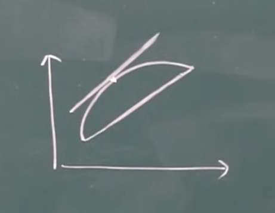

## 微分中值定理

### 罗尔定理

需要费马引理来证明

#### 费马引理

函数 $f(x)$ 在点 $x_0$ 的邻域 $U(x_0)$ 内有定义，且函数在 $x_0$ 处可导

如果对任意 $x\in U(x_0)$，有

$f(x)\leq f(x_0)$

则 $f'(x_0)=0$

##### 理解

$x_0$ 位于函数的最大（小）值点

##### 证明

左右导数分别 小于等于、大于等于0

又因为必须可导，所以导数等于0

#### 驻点

导数为0的点，就叫**驻点**

注意驻点不一定要是最小值或者最大值

#### 罗尔中值定理

若 $f(x)$ 满足三个条件:

* 在 $[a,b]$ 连续

* 在 $(a,b)$ 可导

* 区间端点处函数值相等，即 $f(a)=f(b)$

则，$(a,b)$ 内**至少**有一点 $\xi$，使得 $f'(\xi)=0$

##### 理解

几何理解即可：一笔画+光滑

### 拉格朗日中值定理

函数满足以下条件:

* 在 $[a,b]$ 连续

* 在 $(a,b)$ 可导

则，$(a,b)$ 内**至少**有一点 $\xi$，使得 $f(b)-f(a)=f'(\xi)(b-a)$

#### 理解

$f(b)-f(a)=f'(\xi)(b-a)$

$→f'(\xi)=\frac {f(b)-f(a)}{b-a}$

切线斜率和两个端点连线平行

#### 推论

$f(x)$ 在区间 $I$ 内连续且可导，且导数恒为0，则 $f(x)=C$

上述推论可以用拉格朗日中值定理证明

任取函数上两点代入拉格朗日中值定律即可

### 柯西中值定律

两个函数 $f(x),F(x)$

满足以下条件:

* 在 $[a,b]$ 连续

* 在 $(a,b)$ 可导

* 对任意一点 $x\in (a,b)$，$F'(x)\neq 0$

则 $(a,b)$ 内至少有一点 $\xi$，使得 $\frac {f(b)-f(a)}{F(b)-F(a)}=\frac {f'(\xi)}{F'(\xi)}$

#### 理解

$\frac {f(b)-f(a)}{f'(\xi)}=\frac {F(b)-F(a)}{F'(\xi)}$

2024.4.6